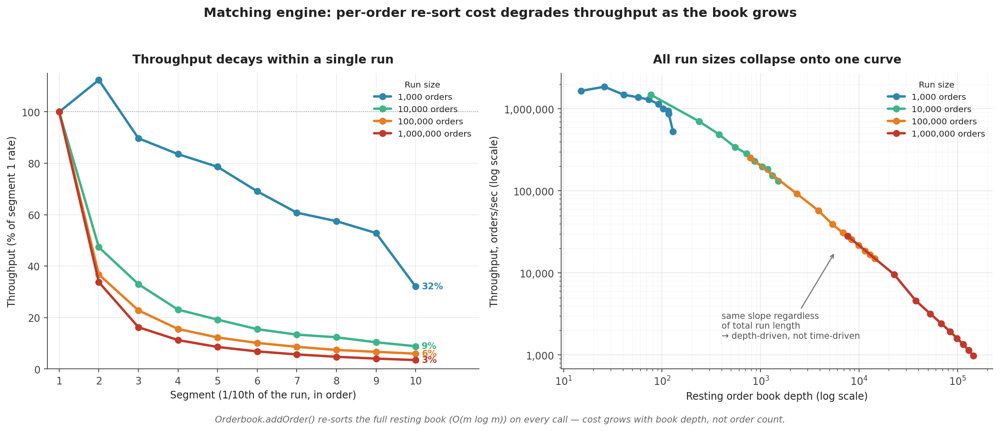

# Matching Engine Correctness & Performance Report

Test suite and benchmark results for the in-memory price-time priority matching engine that powers [Exchange Lab](https://xchg.viveksahu.com/) ([repo](https://github.com/vivek-src/exchange-lab)).

This document covers two separate concerns:

- **Correctness** — does the engine behave right? (unit tests + invariant/property tests)
- **Performance** — how fast is it, and where does it degrade? (isolated benchmark)

## Correctness: Test Suite

```text
Test Files  4 passed (4)
    Tests  83 passed (83)
  Duration  636ms
```

83 tests across ID generation, order matching, balance/settlement, and system-wide invariants (price-time priority, no crossed book, balance/quantity conservation, no duplicate fills) — the invariant suite runs these checks against randomized order/cancellation sequences, including a 1,000-order stress test, rather than just fixed known cases.

Correctness and performance are reasoned about separately on purpose: a matching engine that's fast but occasionally crosses the book, double-fills a trade, or loses a balance is worse than a slow one. The invariant suite provides confidence that the throughput numbers below describe a correct engine under load.

## Performance: Isolated Benchmark

**Component:** In-memory price-time priority matching engine (`packages/engine`)

**Method:** Synthetic deterministic order streams (seeded RNG, reproducible), measured in isolation — no HTTP, Redis, or DB in the loop. 90% new orders / 10% cancels, prices uniformly distributed in a narrow band to force realistic matching density.

### Summary

- System Information:
- Node.js: v24.20.0
- Platform: linux x64
- CPUs: 16× AMD Ryzen 7 7700X 8-Core Processor
- Memory: 32 GB
- Date: 2026-09-08T17:12:24.958Z

**Sizes tested:** 1,000 / 10,000 / 100,000 / 1,000,000 orders
| Orders | Orders/s | p50 µs | p99 µs | Max µs | Mem MB | Decay | Throughput trend |
| --------- | -------- | ------ | ------ | ------- | ------ | ----- | ---------------- |
| 1,000 | 1081591 | 0.7 | 1.9 | 6.7 | 1.9 | 0.55x | ▇█▅▃▁▁▃▃▃▂ |
| 10,000 | 244723 | 3.7 | 10.2 | 275.9 | 0.0 | 0.11x | █▄▃▂▁▁▁▁▁▁ |
| 100,000 | 28059 | 35.3 | 78.8 | 727.5 | 0.0 | 0.06x | █▃▂▁▁▁▁▁▁▁ |
| 1,000,000 | 1898 | 466.3 | 2163.4 | 19444.6 | 7.1 | 0.03x | █▃▁▁▁▁▁▁▁▁ |

At small scale the engine is fast — sub-microsecond p50 latency and over 1M orders/sec. However, throughput does not hold as the resting order book grows: by the end of the 1,000-order run it is down to about a third of its starting rate, and by the end of the 1M-order run it is down to 3.5%, a roughly 29x drop from where that same run started.

> **Note:** Run-to-run variance is approximately 2–7% of a prior run at every size, consistent with normal JIT/GC noise rather than a change to the engine. The 1,000-order decay ratio varies more between runs because a 1,000-order run only has approximately 100 orders per segment, making its last-segment measurement the noisiest of the four.

## Latency Metrics

Latency percentiles describe how long individual order-processing operations take:

- **p50** — median latency; 50% of operations complete within this time.
- **p95** — 95% of operations complete within this time; represents the slower 5% tail.
- **p99** — 99% of operations complete within this time; represents the slower 1% tail.
- **Max** — latency of the single slowest measured operation.

Lower latency is better. p50 represents typical performance, while p95 and p99 expose tail-latency behavior that averages can hide.

## Root Cause

`Orderbook.addOrder()` re-sorts the _entire_ resting book on every call:

```ts
this.asks.sort((x, y) => x.price - y.price);
this.bids.sort((y, x) => y.price - x.price);
```

This runs unconditionally on every order, not just when a new order changes the book's ordering.

The cost per order is `O(m log m)`, where `m` is the current resting book size. As the resting book grows with the number of submitted orders, total work can approach quadratic in the number of orders.

A `TODO` in the source already flags the intended direction of the fix: move sorting to the order-insertion phase rather than repeatedly sorting the entire book during matching.

## Throughput vs. Book Depth



The left panel shows throughput falling within each run, normalized to that run's own starting rate.

The right panel plots throughput against resting book depth on a log-log scale. The four benchmark sizes follow roughly the same curve, showing that throughput degradation is strongly correlated with book depth rather than simply elapsed benchmark time.

Splitting each run into 10 equal segments and tracking orders/sec and resting book depth makes the mechanism visible directly rather than relying only on aggregate throughput.

### 100,000-order run

| Segment | Orders/sec | Avg resting book depth |
| ------: | ---------: | ---------------------: |
|       1 |    252,440 |                    788 |
|       2 |     92,797 |                  2,326 |
|       3 |     57,601 |                  3,862 |
|       4 |     39,322 |                  5,347 |
|       5 |     30,962 |                  6,837 |
|       6 |     25,589 |                  8,353 |
|       7 |     21,789 |                  9,888 |
|       8 |     18,684 |                 11,450 |
|       9 |     16,837 |                 12,956 |
|      10 |     15,079 |                 14,442 |

Throughput falls in lockstep with book depth — approximately a 17x drop in orders/sec against an approximately 18x growth in book size, consistent with per-order cost scaling with `m`.

The 1,000 / 10,000 / 1,000,000-order runs show the same general shape at different magnitudes. Full segment data is available in `engine-benchmark-segments-*.csv`.

## What This Demonstrates

- **Found through isolated measurement.** The engine was benchmarked independently from HTTP, Redis, and the database to measure matching-engine cost directly.
- **Quantified the bottleneck.** The engine shows a measured 96.5% throughput loss from the beginning to the end of the 1M-order run, correlated segment-by-segment with increasing book depth.
- **Reproducible.** The benchmark uses seeded order streams and deterministic cancel selection, allowing aggregate throughput and the shape of the decay curve to be compared across runs.
- **Optimization implemented.** Resting orders were moved from a single sorted array per side to a price-level `Map` with a per-level FIFO linked-list structure. The optimized implementation is being validated against the same benchmark workload.

## Design Comparison: Map + Linked List vs. Plain Array

The initial optimization replaced the flat sorted array with a `Map<price, Order[]>`, sorting only when a genuinely new price appeared.

That fixed the full-book sort cost but introduced another scaling problem: with a narrow price range, most orders concentrate into a handful of price levels. Removing a filled order from the front of a large array-backed price level using `splice(0, 1)` is itself `O(level size)` because the remaining elements must be shifted.

The final structure uses a doubly linked list for each price level. Removing the head after a fill or an arbitrary node during cancellation becomes an `O(1)` pointer unlink.

| Aspect                                          | Map + Linked List                                                                                                                     | Plain Array                                             |
| ----------------------------------------------- | ------------------------------------------------------------------------------------------------------------------------------------- | ------------------------------------------------------- |
| `addOrder` (existing price)                     | **O(1) amortized** — append to the price level's tail                                                                                 | O(1) `push()`                                           |
| New price insertion                             | Locate position in sorted price index; binary search is O(log k), but inserting into a normal array index can require **O(k)** shifts | O(1) `push()`, but full sorting occurs before matching  |
| Matching (`matchBuytoAsks` / `matchSelltoBids`) | **O(levels touched + fills)** — prices are already ordered, allowing sequential traversal from the best price outward                 | **O(m log m)** — full `.sort()` before walking the book |
| `cancelOrder`                                   | **O(1)** — `orderLocation` map provides the exact node, which can be unlinked directly                                                | **O(m)** — linear `findIndex` scan plus `splice` shifts |
| Order lookup by ID                              | **O(1)** — map lookup                                                                                                                 | **O(m)** — linear scan                                  |
| `getDepth` / `getOpenOrder`                     | O(m) — must iterate/flatten the relevant orders                                                                                       | O(m) — same fundamental requirement                     |
| Memory overhead                                 | Higher — linked-list nodes, `Map` buckets, and `orderLocation` index                                                                  | Lower — contiguous array storage                        |
| Cache locality                                  | Worse — linked nodes can be scattered in the heap                                                                                     | Better — contiguous arrays are cache-friendly           |
| Code complexity                                 | Higher — manual node linking/unlinking introduces more implementation surface                                                         | Lower — built-in array operations are simpler           |
| Primary scaling factor                          | `k` = distinct price levels, bounded by tick-size granularity in this benchmark                                                       | `m` = total resting orders                              |

### Complexity Caveat

The `Map + Linked List` structure does not automatically make every operation `O(1)`.

Its advantage comes from separating **price levels** from **orders within each price level**:

- Existing price-level insertion is `O(1)` amortized.
- Fill removal from the head of a price level is `O(1)`.
- Cancellation is `O(1)` when the order-location index provides the node directly.
- Matching walks already-ordered price levels rather than repeatedly sorting all resting orders.
- Introducing a brand-new price may still require locating and inserting that price into the sorted price index.

The scalability advantage therefore depends on the number of distinct price levels (`k`) remaining substantially smaller than the number of resting orders (`m`). With realistic tick-size quantization, many orders can share the same price level. If prices were arbitrary floating-point values with no quantization, `k` could approach `m` and the advantage would be reduced.

## Reproduce

Full benchmark:

```bash
npx tsx benchmarks/engine/engine-benchmark.ts
```

Skip the slow 1M-order run:

```bash
npx tsx benchmarks/engine/engine-benchmark.ts --max=100000
```

The benchmark outputs:

```text
engine-benchmark-<timestamp>.json
engine-benchmark-<timestamp>.csv
engine-benchmark-segments-<timestamp>.csv
```

under:

```text
benchmark-results/engine/
```

The JSON and CSV files contain the raw measurements used to produce this report.

### Correctness Suite

```bash
npm run test
```

The current correctness suite uses Vitest and covers matching behavior, balances, ID generation, and exchange invariants.

## Benchmark Interpretation

The current benchmark establishes two important facts:

1. The matching engine is capable of **over 1M orders/sec at small book sizes** with microsecond-level latency.
2. The current implementation has a clear **book-depth-dependent scaling bottleneck**, with throughput falling from 27,618 orders/sec to 927 orders/sec across the segments of the 1M-order workload.

The optimization replaces repeated full-book sorting with explicit price-level and order-level data structures. The next validation step is to run the **same seeded workloads against the optimized implementation** and compare throughput, p50/p99 latency, and memory usage directly against this baseline.

The baseline should remain unchanged so that future optimizations can be evaluated using an identical workload and measurement methodology.
